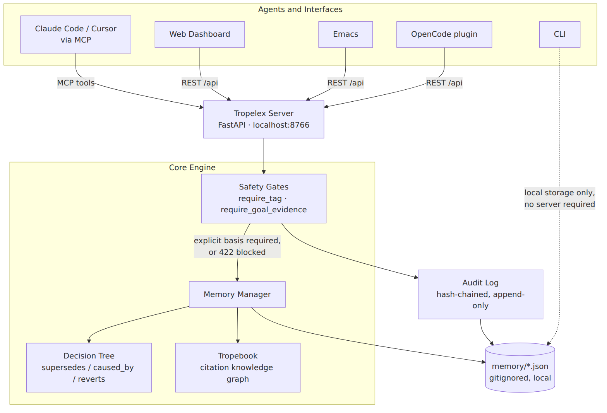
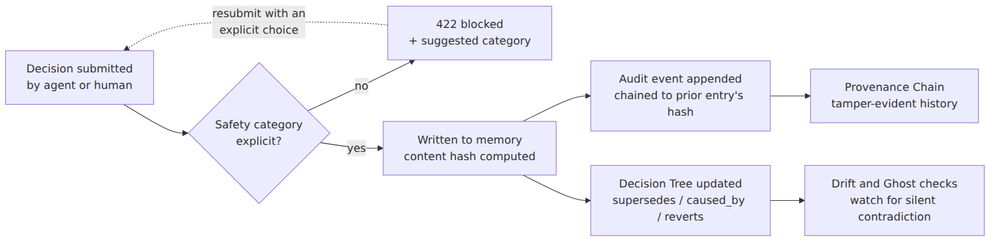
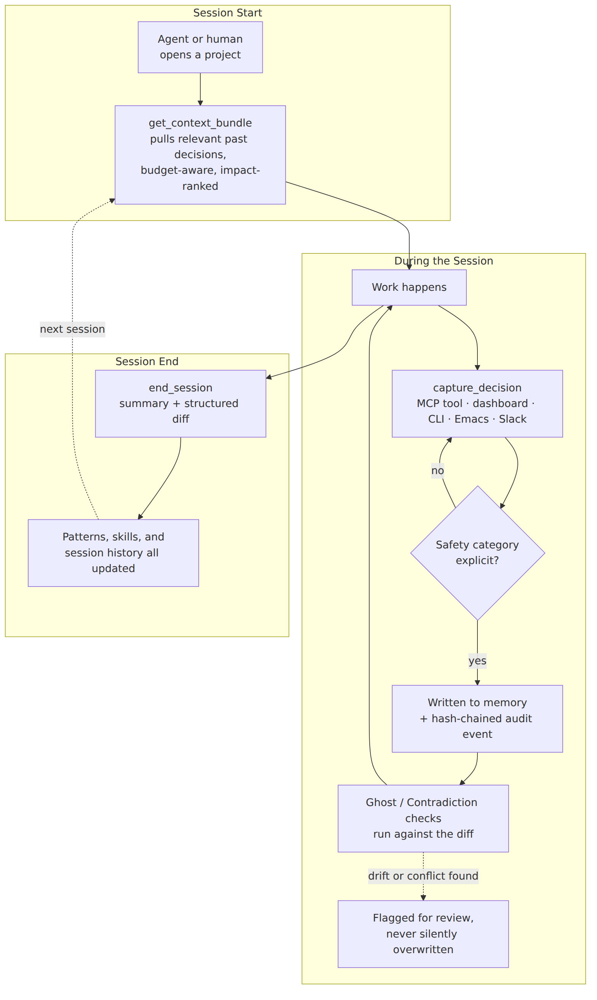

# Tropelex

<p align="center">
  <a href="https://shansimmons-eng.github.io/tropelex/"></a>
  <a href="https://shansimmons-eng.github.io/tropelex/api-reference.html"></a>
  <a href="https://shansimmons-eng.github.io/tropelex/getting-started.html"></a>
  <a href="https://shansimmons-eng.github.io/tropelex/faq.html"></a>
</p>

<p align="center">
  
  
  
  
</p>

---

<p align="center"></p>

> [!NOTE]
> **AI Memory System with Safety and Alignment Infrastructure**

Tropelex accumulates knowledge across projects (decisions, patterns, preferences, research) so sessions don't start from scratch. It grows smarter with use.

The same mechanisms that make an agent's memory useful also make its behavior auditable: an immutable decision history an agent must cross-reference before acting, drift detection that catches code silently diverging from stated intent, and multi-agent handoff that carries rationale across agent boundaries instead of losing it. See [`SAFETY.md`](SAFETY.md) for how these properties apply to agent safety and alignment work.

<p align="center"></p>

<!-- Rendered as a static image (source: images/diagrams/architecture.mmd) rather than a
     live mermaid block -- the GitHub mobile app doesn't render mermaid and falls back to
     raw code; a pre-rendered image displays correctly everywhere. Regenerate with:
     npx @mermaid-js/mermaid-cli -i images/diagrams/architecture.mmd -o images/diagrams/architecture.png -b white -s 2 -->


**Docs, without running anything:** [Full Guide](https://shansimmons-eng.github.io/tropelex/) · [API Reference](https://shansimmons-eng.github.io/tropelex/api-reference.html) · [Getting Started](https://shansimmons-eng.github.io/tropelex/getting-started.html) · [FAQ](https://shansimmons-eng.github.io/tropelex/faq.html)

**Contributing:** [CONTRIBUTING.md](CONTRIBUTING.md) · **Security:** [SECURITY.md](SECURITY.md) · **License:** [MIT](LICENSE)

---

## What it does

<details open>
<summary>⚡ <b>Click to expand / collapse the full 60+ Feature Matrix</b></summary>
<br>

| Component | Purpose |
|---|---|
| **Memory Manager** | Stores project knowledge as JSON: decisions, preferences, session history |
| **Pattern Learner** | Analyzes sessions to detect recurring themes and suggest next steps |
| **Context Compressor** | Strips filler from prompts using AI (OpenAI) or dictionary-based rules, and reduces the surface area untrusted payloads have to carry injected instructions ([SAFETY.md](SAFETY.md#prompt-injection--payload-defense)) |
| **Tropebook** | Research knowledge base (store, search, link citations with a graph) |
| **Agent Pipeline** | 3-stage prompt prep: compress → context check → structure |
| **Prompt Hijacker** | One-click AI compression for any prompt before sending to an AI |
| **Git Integration** | Auto-extract decisions, rationale, and tech stack changes from commits |
| **Decision Trees** | Graph of decision evolution (tracks what caused what, reverts, relationships) |
| **Living ADRs** | Auto-generate Architecture Decision Records from memory data |
| **Session Replay** | Structured memory diffs per session (what changed, rollback support) |
| **Knowledge Decay** | Time-based confidence scoring, where decisions lose reliability over age and stale policy can't silently retain full authority ([SAFETY.md](SAFETY.md#guardrail-ossification-prevention)) |
| **Memory RAG** | Semantic retrieval from project memory at query time |
| **Cross-Pollination** | Surface solutions from similar projects with matching tech stacks |
| **Agent Skills** | Track what the agent has become proficient at per project |
| **Prompt Genealogy** | Track which compression strategies produce the best outcomes |
| **Research Feeds** | Scheduled monitoring with auto-ingest to citations |
| **Repo Seek** | Finds GitHub repos similar to a project's own tech stack/description, scored (not just keyword-matched). Drill into any result as its own search seed, bounded to 3 drill-downs per batch, 2 rounds deep, with a lineage breadcrumb. Exclude unwanted matches permanently, or bookmark one straight into Tropebook as a citation |
| **Deep Research** | Two research engines side by side: multi-source scan via last30days (Reddit, X, YouTube, GitHub, HN, Polymarket + LLM synthesis) and citation-grade web research via web-researcher-mcp, plus a hybrid mode that runs both and has the LLM merge/dedupe them into one report |
| **Ghost Decisions** | Silent objective-drift detection: code contradicts decisions without anyone saying so ([SAFETY.md](SAFETY.md#silent-objective-drift-detection)) |
| **Explainable Memory** | Conversational "why do we...?" with full causal chain |
| **Agent Handoff Packets** | Role-aware context bundles for multi-agent workflows (a working inter-agent coordination protocol) ([SAFETY.md](SAFETY.md#inter-agent-coordination-protocol), [protocol spec](docs/protocols/handoff-packet-spec.md)) |
| **Decision Market** | Confidence bets, calibration tracking, leaderboard: a live calibration and honest-signaling mechanism among cooperating agents ([SAFETY.md](SAFETY.md#calibration--honest-signaling-mechanism)) |
| **Memory Lens** | IDE inline annotations, like GitLens but for decisions |
| **Slack Capture** | Bidirectional Slack integration for decision logging |
| **Time-Travel Debugger** | Memory snapshots as of any past date, for forensic state auditing ([SAFETY.md](SAFETY.md#forensic-state-auditing)) |
| **Contradiction Detection** | Actively scan for unresolved conflicting decisions (surfaces conflicting objectives before they cause harm) ([SAFETY.md](SAFETY.md#conflicting-objective-surfacing)) |
| **Doc Mining** | Scans every markdown file in the repo for drift against recorded decisions, contradictions between docs, and decision-shaped claims never captured in the decision graph. Reuses the Contradiction Detection engine rather than a separate one |
| **Digital Twin Personas** | Synthesize readable persona summaries from agent proficiency |
| **Federated Benchmarking** | Opt-in, privacy-preserving cross-install statistics |
| **Memory Compaction** | Epoch summarization to prevent unbounded memory growth |
| **Friction Mining** | Implicit signal detection from conversation transcripts: a lightweight human-in-the-loop alignment elicitation channel ([SAFETY.md](SAFETY.md#human-in-the-loop-alignment-elicitation)) |
| **Preventive Ghost Checks** | Pre-write hook that checks diff against active decisions: a pre-action policy compliance gate ([SAFETY.md](SAFETY.md#pre-action-policy-compliance-gate)) |
| **Rationale Corroboration** | Fact-check decision rationale against the live web |
| **PR Bot** | Deliver ghost decisions, contradictions as PR comments |
| **Narrative Mode** | Readable prose summaries for non-technical audiences |
| **Cost Ledger** | Per-decision token cost tracking and ROI scoring |
| **Predictive Prefetch** | Budget-aware context assembly prioritized by impact score |
| **Background Scheduler** | Automatic periodic tasks (feeds, ghost scans, stale checks) |
| **Emacs Integration** | Capture decisions and friction signals directly from Emacs: compilation errors, rapid saves, manual decisions |
| **Safety Metadata** | Risk classification, reversibility tracking, affected systems, safety categories for every decision |
| **Safety Dashboard** | Risk trend analysis, system exposure monitoring, safety score calculation |
| **Decision Impact Analysis** | Dependency graphs, risk propagation, critical system identification |
| **Safety Review Workflow** | Approval/rejection workflow with reviewer tracking and mitigation suggestions |
| **Alignment Evaluation** | Scoring across interpretability, safety, fairness, robustness, governance |
| **Governance Compliance** | Policy compliance checking against EU AI Act, NIST, ISO 42001 frameworks |
| **Interpretability Reports** | Human-readable explanations of decision rationale and factors |
| **Fairness Audit** | Bias detection across decision categories and affected systems |
| **Accountability Tracking** | Reviewer accountability, decision chains, gap identification |
| **Robustness Testing** | Single points of failure, irreversible risks, concentration risk analysis |
| **Provenance Chain** | Cryptographic hash chain of decision history for tamper detection |
| **Integrity Verification** | Hash chain validation, timestamp ordering, structure verification |
| **Security Audit Log** | Immutable chronological log of all security-relevant events |
| **Decision Versioning** | Version history, rollback support, change tracking |
| **Automated Safety Checks** | Pre-decision safety analysis with risk scoring and recommendations |
| **Synthetic Data Policy** | EU AI Act Articles 10 & 50 compliant "nutritional label" for synthetic datasets: fidelity, privacy, bias audits, blocking gates |

</details>

---

## Safety & Alignment Documentation

Tropelex doubles as empirical safety infrastructure for autonomous agents. For the alignment reframing of its features, threat models, and grant-specific technical summaries, see:

<p align="center"></p>

<!-- Rendered as a static image (source: images/diagrams/safety-gate.mmd). See the note
     on the architecture diagram above for why, and the regeneration command. -->


> [!IMPORTANT]
> Nothing here claims the agent's judgment is trustworthy. The claim is narrower: a decision can't be recorded without an explicit basis, and every write leaves a trace that's expensive to fake and cheap to check.

- [SAFETY.md](./SAFETY.md): mapping developer features to AI safety & control terminology.
- [CAIS Grant Technical Summary](./docs/cais-summary.md) (objective drift and reward hacking prevention).
- [FAR AI Grant Technical Summary](./docs/far-ai-summary.md): cooperative multi-agent coordination and calibration.
- [SFF Grant Technical Summary](./docs/sff-summary.md) (independent developer, open-source safety infrastructure).
- [Agent Handoff Packet Protocol Spec](./docs/protocols/handoff-packet-spec.md): the wire format, independent of the Python implementation.

---

## Requirements

- Python 3.10+
- `uv` (recommended) or `pip`
- OpenAI API key (for AI compression; optional, dictionary fallback available)
- Brave Search API key (optional, falls back to DuckDuckGo free)
- xAI API key (optional, enables X/Twitter search + LLM planner for Deep Research)
- ScrapeCreators API key (optional, unlocks Reddit without rate limits, TikTok, Instagram, Threads, Pinterest)
- GitHub token (`GITHUB_TOKEN` or `GH_TOKEN`, optional, raises Repo Seek's GitHub Search rate limit above the unauthenticated 60/hr)

---

## Installation

```bash
git clone https://github.com/yourusername/tropelex.git
cd tropelex

# With uv (recommended)
uv venv
uv pip install -r requirements.txt

# Or with pip
pip install -r requirements.txt
```

---

## Quick Start

### 1. Set your API key

Create a `.env` file in the project root:

```bash
OPENAI_API_KEY=sk-your-key-here
BRAVE_SEARCH_API_KEY=your-brave-key-here   # optional
```

Or set via environment:

```bash
export OPENAI_API_KEY=sk-your-key-here
```

### 2. Start the server

```bash
# With uv
uv run python -m core.tropebook.web.server

# Or with python
python -m core.tropebook.web.server
```

### 3. Open the UI

Visit **http://localhost:8766** in your browser.

### 4. (Optional) Use the Prompt Hijacker

Visit **http://localhost:8766/hijacker**. Paste any verbose prompt and get it AI-compressed in one click.

---

## Workflow

What the loop above actually looks like once an agent is wired up: each session both draws on and adds to the same memory, so context compounds instead of resetting every time:

<p align="center"></p>

<!-- Rendered as a static image (source: images/diagrams/workflow.mmd). See the note
     on the architecture diagram above for why, and the regeneration command. -->


---

## Web Interface

The dashboard sidebar groups 32 sections into 9 categories, the same grouping used in `wishlist.md` for the feature backlog. Within a category, sections are ordered as they appear in the sidebar. Safety & Alignment is a single sidebar entry that opens onto seven in-page tabs (listed below) rather than seven separate sidebar entries, since those seven are all facets of one thing.

### Engine Core
Browsing and visualizing what's stored.

#### Dashboard
Landing overview: quick stats, recent activity, and the Getting Started checklist.

#### Tropebook
Add, search, and manage research citations. Each citation can have tags, entities, and relationships to other citations.

- **Add Citation**: manually add a URL with title, summary, tags
- **Import**: import JSON from Google Deep Research / NotebookLM export
- **Search**: full-text search across titles and summaries
- **Sync**: refresh all data from the server

#### Memory
Project-based persistent memory. Each project stores:
- Decisions (key choices made during development)
- Session history (what was worked on and when)
- Tech stack
- Preferences

#### Patterns
Automatically detected patterns from session history. Shows what categories of work (UI, backend, bug fixes, etc.) appear most frequently, with AI-generated suggestions for next steps.

#### Graph
Interactive, force-directed knowledge graph of decisions and their relationships. Node size reflects confidence/age, edge color reflects relationship type, filterable by date range, confidence tier, and category.

### Quality & Integrity
Surfacing problems in the decision corpus: stale, contradictory, or silently-drifted decisions.

#### Insights
Decision intelligence and knowledge analysis:
- **Decision Confidence**: time-based reliability scoring (decays with age, boosted by references)
- **Agent Proficiency**: tracks what the agent is good at per category (ui, backend, testing, etc.)
- **Decision Timeline**: every decision with source, confidence, rationale, and relationship tags
- **Decision Chains**: visualizes causal chains (A caused B caused C)
- **ADR Generation**: one-click Architecture Decision Records in Nygard, MADR, or Tropelex format
- **Session Replay**: structured memory diffs, rollback support
- **Cross-Project Knowledge**: finds transferable solutions from similar projects

#### Health
Memory health dashboard: stale-decision alerts, category coverage gaps, growth trends, per-project quality scores, and maintenance recommendations.

#### Impact
Decision Impact Analysis: links decisions to the commits/tasks that followed, tracks reversal rate and time-to-value, and scores architectural choices by ROI.

#### Ghost Decisions
Diffs incoming commits against the decision corpus to flag "ghost decisions": code that silently contradicts a recorded decision without anyone documenting the drift.

#### Pre-Write Guard
Runs the same ghost-decision check *before* a diff is finalized, not after commit: prevention instead of after-the-fact detection.

#### Friction Mining
Mines session transcripts for implicit friction signals (corrections, rephrasing, retry loops, rapid edits) that never got explicitly logged as decisions. Feeds a session-level friction score into the Health Dashboard.

#### Contradictions
Actively scans for unresolved contradictions between decisions that are both still marked active (e.g., "use REST" and "use GraphQL" with no supersede link), with resolution suggestions.

### Explainability & Discovery
Helping a human or agent find and understand what's already known.

#### Why Do We...?
Conversational front-end that answers "why do we...?" questions by fusing RAG, the decision tree, and impact analysis into a full causal chain: provenance, supersession, downstream impact, and source citations.

#### Context Prefetch
Predicts the minimal context bundle for a task before an agent starts, sized to a token budget and prioritized by impact score rather than recency. Near-misses are surfaced with their scores instead of silently dropped.

#### Doc Mining
Mines project markdown files for drift, contradictions, and undocumented decisions that never made it into the decision graph.

### Safety & Alignment
Risk classification, review workflow, and compliance framing for the decision graph (one sidebar entry, seven in-page tabs). Each tab lazy-loads only its own data when selected. See [SAFETY.md](./SAFETY.md) for the full alignment/control-terminology mapping.

#### Dashboard (tab)
Risk trends, system exposure, and aggregate safety score across a project's decisions.

#### Alignment (tab)
Scoring across interpretability, safety, fairness, robustness, and governance, with drift detection between evaluation runs.

#### Governance (tab)
Compliance checks against EU AI Act, NIST, and ISO 42001 policies, plus fairness, accountability, robustness, and interpretability reports.

#### Provenance (tab)
Provenance chain, integrity verification, tamper detection, and an immutable security audit log for every decision.

#### Reviews (tab)
Review workflow for decisions flagged `requires_review`: pending queue, approve/reject, reviewer accountability, mitigation suggestions.

#### Synthetic Data (tab)
EU AI Act Art. 10 & 50 compliant registration for synthetic datasets used in agent training/eval: fidelity, privacy budget, bias audit, adversarial testing, and 10 blocking compliance gates.

#### Agent Audit (tab)
Every other feature in this app audits decisions and code; this audits the agent's own harness configuration (`CLAUDE.md`/`AGENTS.md`, `.mcp.json`, `.claude/settings.json`, hooks, agent definitions, and skills) across five categories: hardcoded secrets, over-broad tool permissions, hook-injection risk, MCP server risk profiling, and injected-instruction patterns in agent/skill definitions. Read-only, A–F graded, defaults to scanning this Tropelex instance's own repo when no path is given.

### Memory Lifecycle
Keeping the memory store itself navigable and bounded as it grows.

#### Time Travel
Check out project memory as of any past date and generate agent context as if it were that point in time: a forensic tool for postmortems.

#### Memory Compaction
Collapses superseded or low-confidence decision chains into higher-level "epoch summaries" so memory matures instead of growing unbounded. Originals are archived, never deleted.

### Research & Ingestion
Pulling outside information in.

#### Prompt Lab
3-stage prompt preprocessor:
1. **Compression**: AI strips filler, fixes typos, makes prompts imperative
2. **Context Check**: flags vague or missing context
3. **Structure**: formats output as TASK / CONSTRAINTS / CONTEXT

The final output is ready to paste into any AI assistant.

#### Feeds
Scheduled research feeds with trend detection across runs, anomaly flagging, cross-feed correlation, and email/Slack alerts for high-relevance changes.

#### Deep Research
Two independent research engines, laid out side by side so neither buries the other, plus a hybrid mode:

- **Multi-Source Scan**: last30days engine. Searches Reddit, X, YouTube, GitHub, HackerNews, Polymarket, and web grounding in parallel, then synthesizes findings into a narrative brief with source citations and key patterns. 1–3 minutes, synchronous.
- **Citation-Grade Web Research**: [web-researcher-mcp](https://github.com/zoharbabin/web-researcher-mcp) (spoken to directly over MCP's stdio protocol, no extra Python dependency). Runs a small loop of search → LLM-refined follow-up query → search again, and imports every real, verifiable source URL straight into the Tropebook citation library. Requires the `web-researcher-mcp` binary on `PATH`.
- **Hybrid**: runs both engines concurrently on the same query, then asks the project's LLM backend to deduplicate and merge them into a single report. Degrades gracefully if one engine fails: the other's results (and any citations it found) are still returned and imported.

Configure sources for the multi-source scan in Settings → Deep Research Sources. Citation-grade research prefers `BRAVE_SEARCH_API_KEY` when set (falls back to the free DuckDuckGo provider otherwise, which rate-limits more aggressively under repeated use).

#### Repo Seek
Finds GitHub repositories similar to the current project, scored on tech-stack/language match, description overlap, and star count, not GitHub's own literal keyword search. Each result has three actions:

- **Scan Item**: profiles the result as if it were its own project and searches from there, forming a lineage tree (shown as a breadcrumb above the table). Bounded on purpose — at most 3 drill-downs per batch, at most 2 rounds deep — after which the tree is terminal. A search that turns up nothing new (everything found was already excluded, or already in the batch it was derived from) is a normal stopping point, not an error.
- **Exclude**: permanently removes a repo from this and every future scan for the project.
- **Add Citation**: opens a prefilled modal and adds the result straight into Tropebook; the row stays in the results.

Copy the current batch as JSON or Markdown, or export the project's full scan history as one Markdown file. Configure `GITHUB_TOKEN` or `GH_TOKEN` to raise GitHub's rate limit above the unauthenticated 60/hr.

### Team & Collaboration
Getting decisions to the humans (and other agents) who need them.

#### Agent Handoff
Generates role-aware context packets when one agent's session hands off to another: a TestEngineer gets test-relevant decisions and coverage gaps, a Frontend specialist gets something different. Token-budget-aware.

#### PR Bot
Delivers ghost decisions, contradictions, and health scores as PR comments, so detection reaches developers where they already work instead of sitting in a dashboard.

#### Narrative
Converts the decision graph and git history into readable prose, "what was tried, what failed, why," with presets for investors, new hires, and PMs. Exports to markdown/PDF.

#### Decision Market
Team members place confidence bets on decisions before they're finalized; tracks bet accuracy against outcomes for per-person and per-category calibration scores.

#### Slack Capture
Bidirectional Slack integration: `/tropelex decide "..."` captures a decision inline, `/tropelex ask "..."` queries memory, with automatic extraction from chat threads.

#### Personas
Synthesizes "digital twin" persona summaries from agent proficiency tracking: strengths, weaknesses, and historical accuracy per category, meant as calibration notes for reviewers.

### Integrations & Ops
Cross-system hooks and cost accounting.

#### Git
Repository integration and deep analysis:
- **Summary**: tech stack detection, work category frequency, recent commits
- **Sync**: extract decisions from conventional commits
- **Deep Sync**: parse diffs, detect rationale, dependency changes, revert chains, structural patterns

#### Benchmarks
Opt-in, privacy-preserving comparison of structural statistics (not decision text) across projects. Sharing and aggregation are local to one install by default; Export/Import move a bundle of shared stats between installs as a plain JSON file (no networking) for true cross-machine comparison.

#### Cost Ledger
Tracks token/dollar cost per decision, including rework cost on reversals, to give ROI scoring a real denominator.

### System

#### Getting Started
Onboarding checklist: create a project, record a decision, configure API keys, set up research feeds.

#### Settings
Configure compression behavior, session limits, and API keys. Keys entered here are written directly to your `.env` file. Includes a **Deep Research Sources** panel for configuring xAI, ScrapeCreators, Bluesky, and other keys that expand deep research coverage.

---

## API

The server exposes a REST API at `http://localhost:8766/api/`:

<details>
<summary>🔌 <b>Click to expand / collapse full REST API Reference tables</b></summary>
<br>

### Core

| Method | Endpoint | Description |
|---|---|---|
| GET | `/api/health` | Server status |
| GET | `/api/citations` | List all citations |
| POST | `/api/citations` | Add a citation |
| PATCH | `/api/citations/{id}` | Update a citation |
| DELETE | `/api/citations/{id}` | Delete a citation |
| DELETE | `/api/citations/clear` | Delete all citations |
| GET | `/api/search?q=query` | Search citations |
| POST | `/api/compress` | AI-compress a prompt |
| GET | `/api/memory` | List projects |
| GET | `/api/memory/{project}` | Get project memory |
| POST | `/api/memory` | Create a project |
| PATCH | `/api/memory/{project}` | Update project description/stack/prefs |
| GET | `/api/patterns` | Get learned patterns + suggestions |
| POST | `/api/import` | Import citations from JSON |
| GET | `/api/export` | Export all data as JSON |
| POST | `/api/settings/apikey` | Save an API key to `.env` |

### Git Integration

| Method | Endpoint | Description |
|---|---|---|
| GET | `/api/git/summary` | Basic repo summary |
| GET | `/api/git/deep-summary` | Deep analysis with categories, reverts, rationale |
| POST | `/api/git/sync` | Sync conventional commits to memory |
| POST | `/api/git/sync-deep` | Deep sync with diff parsing and dependency detection |

### Decision Trees & ADRs

| Method | Endpoint | Description |
|---|---|---|
| GET | `/api/memory/{project}/decision-tree` | Full decision tree with relationships |
| GET | `/api/memory/{project}/decision-tree/timeline` | Timeline with confidence scores |
| GET | `/api/memory/{project}/decision-tree/chains` | Decision chains (A caused B caused C) |
| GET | `/api/memory/{project}/decision-tree/{id}` | Single decision with ancestors/descendants |
| GET | `/api/memory/{project}/adrs` | Generate ADRs (nygard/madr/tropelex format) |
| GET | `/api/memory/{project}/adrs/bundle` | Download all ADRs as single markdown |

### Session Replay

| Method | Endpoint | Description |
|---|---|---|
| GET | `/api/memory/{project}/sessions` | List recent sessions |
| GET | `/api/memory/{project}/sessions/{id}` | Full session detail with snapshots |
| GET | `/api/memory/{project}/sessions/{id}/changes` | Just the changes for a session |
| POST | `/api/memory/{project}/sessions/record` | Record current state as snapshot |
| POST | `/api/memory/{project}/sessions/{id}/rollback` | Rollback memory to before a session |
| GET | `/api/memory/{project}/sessions/weekly-summary` | What changed this week |

### Knowledge Decay & Confidence

| Method | Endpoint | Description |
|---|---|---|
| GET | `/api/memory/{project}/confidence` | Confidence summary (avg, tiers, stale count) |
| GET | `/api/memory/{project}/stale` | Stale decisions (low confidence or old) |
| GET | `/api/memory/{project}/decisions/scored` | All decisions with confidence scores |
| POST | `/api/memory/{project}/decay/apply` | Apply confidence scores to memory |

### RAG & Cross-Pollination

| Method | Endpoint | Description |
|---|---|---|
| POST | `/api/memory/{project}/rag` | Retrieve relevant memory snippets |
| POST | `/api/memory/{project}/rag/context` | Retrieve as formatted context string |
| GET | `/api/memory/{project}/cross-pollinate` | Find transferable knowledge from similar projects |
| GET | `/api/memory/{project}/cross-pollinate/briefing` | Cross-project knowledge briefing |
| POST | `/api/memory/{project}/suggest-approaches` | Suggest approaches for a problem |

### Agent Skills & Prompt Genealogy

| Method | Endpoint | Description |
|---|---|---|
| GET | `/api/memory/{project}/agent-skills` | Agent skill scores |
| POST | `/api/memory/{project}/agent-skills/record` | Record session outcome |
| GET | `/api/memory/{project}/agent-skills/briefing` | Proficiency briefing |
| GET | `/api/memory/{project}/prompt-genealogy` | Compression strategy stats |
| POST | `/api/memory/{project}/prompt-genealogy/record` | Record a compression |
| POST | `/api/memory/{project}/prompt-genealogy/outcome` | Record compression outcome |
| GET | `/api/memory/{project}/prompt-genealogy/rankings` | Strategy rankings |

### Research Feeds

| Method | Endpoint | Description |
|---|---|---|
| GET | `/api/research-feeds` | List all feeds |
| POST | `/api/research-feeds` | Create a new feed (accepts `research_provider`: `web_search` or `deep_research`) |
| GET | `/api/research-feeds/stats` | Get feed statistics |
| POST | `/api/research-feeds/tick` | Run all due feeds (rate limited) |
| GET | `/api/research-feeds/{id}` | Get feed details |
| PUT | `/api/research-feeds/{id}` | Update a feed |
| DELETE | `/api/research-feeds/{id}` | Delete a feed |
| POST | `/api/research-feeds/{id}/run` | Run a feed now |
| GET | `/api/research-feeds/{id}/runs` | Get run history |
| GET | `/api/research-feeds/{id}/markdown` | Get feed output as markdown |
| GET | `/api/research-feeds/{id}/intelligence` | Get feed trend detection and anomaly report |
| GET | `/api/research-feeds/{id}/citations` | Get feed citations |

### Deep Research (last30days)

| Method | Endpoint | Description |
|---|---|---|
| POST | `/api/last30days/query` | Run a deep research query, returns HTML output + citations (1–3 min) |

### Deep Research (web-researcher-mcp)

| Method | Endpoint | Description |
|---|---|---|
| POST | `/api/memory/{project}/deep-research/web-research` | Citation-grade multi-step web research; imports results into the Tropebook |
| POST | `/api/memory/{project}/deep-research/hybrid` | Runs last30days + web-researcher-mcp concurrently, LLM-merges the results |

### Repo Seek

| Method | Endpoint | Description |
|---|---|---|
| GET | `/api/reposeek/scan?project=` | Scan for repos similar to a project's own profile; persists a new depth-0 batch |
| POST | `/api/reposeek/{project}/batches/{batch_id}/items/scan` | "Scan Item" — profile one result as its own project, search from it, persist a child batch |
| POST | `/api/reposeek/{project}/exclude` | Permanently exclude a repo from future scans |
| DELETE | `/api/reposeek/{project}/exclude?url=` | Undo an exclude |
| GET | `/api/reposeek/{project}/exclude` | List the current exclude list |
| GET | `/api/reposeek/{project}/batches` | Summary of every batch (lineage: depth, parent, source item) |
| GET | `/api/reposeek/{project}/batches/{batch_id}` | Full detail for one batch, including results |
| GET | `/api/reposeek/{project}/export?format=json\|markdown` | Export one batch or the project's full scan history |

### Safety & Alignment

| Method | Endpoint | Description |
|---|---|---|
| **Safety Metadata** | | |
| POST | `/api/memory/{project}/decisions` | Add decision with optional `safety_metadata` (risk_level, reversibility, affected_systems, safety_category, requires_review) |
| GET | `/api/memory/{project}/safety-stats` | Aggregated safety statistics (risk distribution, safety score) |
| GET | `/api/memory/{project}/safety-dashboard` | Safety metrics with trends and system exposure |
| GET | `/api/memory/{project}/safety-trend` | Time-series risk data for charting |
| **Decision Impact** | | |
| GET | `/api/memory/{project}/decision-impact` | System-wide impact analysis with dependency graph and risk propagation |
| GET | `/api/memory/{project}/decision-impact/{id}` | Per-decision impact with related decisions and dependency chain |
| **Safety Review Workflow** | | |
| GET | `/api/memory/{project}/reviews/pending` | Decisions requiring review (sorted by risk) |
| GET | `/api/memory/{project}/reviews/history` | Review history with optional status filter |
| GET | `/api/memory/{project}/reviews/stats` | Approval rates, reviewer activity, avg review time |
| POST | `/api/memory/{project}/decisions/{id}/review` | Submit safety review (reviewer, status, comments, mitigation) |
| POST | `/api/memory/{project}/decisions/{id}/approve` | Quick-approve a decision |
| POST | `/api/memory/{project}/decisions/{id}/reject` | Quick-reject a decision |
| **Alignment & Governance** | | |
| GET | `/api/memory/{project}/alignment/evaluate` | Project-wide alignment scoring across 5 categories |
| POST | `/api/memory/{project}/decisions/{id}/alignment` | Per-decision alignment evaluation with custom criteria |
| GET | `/api/memory/{project}/alignment/values` | Check decisions against organizational values |
| GET | `/api/memory/{project}/alignment/drift` | Detect alignment drift over time |
| GET | `/api/memory/{project}/safety-envelope` | Monitor safety boundaries and thresholds |
| GET | `/api/memory/{project}/corrigibility` | Track ability to correct/override decisions |
| GET | `/api/memory/{project}/governance/policies` | Governance policy definitions |
| GET | `/api/memory/{project}/governance/compliance` | Governance compliance checking |
| GET | `/api/memory/{project}/interpretability/{id}` | Human-readable interpretability report |
| **Fairness, Accountability, Robustness** | | |
| GET | `/api/memory/{project}/fairness/audit` | Bias detection across categories and systems |
| GET | `/api/memory/{project}/accountability/report` | Reviewer accountability and decision chains |
| GET | `/api/memory/{project}/robustness/test` | Single points of failure, irreversible risks |
| GET | `/api/memory/{project}/transparency/report` | Human-readable decision summaries |
| **Provenance, Integrity, Security** | | |
| GET | `/api/memory/{project}/provenance/chain` | Cryptographic hash chain of decisions |
| GET | `/api/memory/{project}/integrity/verify` | Verify hash chain and timestamp ordering |
| GET | `/api/memory/{project}/tamper-detection` | Detect duplicate IDs, timestamp anomalies |
| GET | `/api/memory/{project}/security/audit-log` | Immutable chronological security event log |
| **Compliance & Versioning** | | |
| GET | `/api/memory/{project}/compliance/report` | EU AI Act, NIST, ISO 42001 compliance reports |
| POST | `/api/memory/{project}/decisions/{id}/version` | Create version snapshot |
| GET | `/api/memory/{project}/decisions/{id}/versions` | Get version history |
| POST | `/api/memory/{project}/decisions/{id}/rollback/{v}` | Rollback to previous version |
| GET | `/api/memory/{project}/stakeholder-impact` | System/stakeholder impact matrix |
| GET | `/api/memory/{project}/risk-heatmap` | Risk distribution for visualization |
| POST | `/api/memory/{project}/safety-check` | Pre-decision safety analysis |
| **Synthetic Data Policy** | | |
| POST | `/api/memory/{project}/synthetic-data-policies` | Register a synthetic dataset with full metadata |
| GET | `/api/memory/{project}/synthetic-data-policies` | List all registered synthetic datasets |
| GET | `/api/memory/{project}/synthetic-data-policies/{id}` | Get full policy details |
| PUT | `/api/memory/{project}/synthetic-data-policies/{id}` | Update a policy |
| DELETE | `/api/memory/{project}/synthetic-data-policies/{id}` | Delete a policy |
| GET | `/api/memory/{project}/synthetic-data-policies/{id}/compliance` | Run compliance check with blocking gates |
| GET | `/api/memory/{project}/synthetic-data/summary` | Aggregate statistics across all policies |

</details>

---

## Python API

### Memory

```python
from core.memory.manager import MemoryManager

mm = MemoryManager()
mm.add_decision("my-project", "Used FastAPI", "REST API needed async support")
mm.set_preference("my-project", "ui", "mobile-first")
context = mm.get_context_for_project("my-project")
print(context)  # Inject into agent system prompt
```

### Tropebook

```python
from core.tropebook import Tropebook

tb = Tropebook()
cid = tb.add("Python Docs", "https://docs.python.org", summary="Official Python docs", tags=["python"])
results = tb.search("async")
tb.link(cid1, cid2, "related_to")
tb.export_json()
```

### Compression

```python
from core.compression.dictionary import compress

# Level 1 = phrase remaps only
# Level 2 = + filler word removal
# Level 3 = + aggressive stop word strip
compressed = compress("could you please help me with implementing a function", level=2)
# -> "help implementing function"
```

### Pattern Learner

```python
from core.learner.learner import PatternLearner
from core.memory.manager import MemoryManager

mm = MemoryManager()
learner = PatternLearner(mm)
analysis = learner.analyze_session("my-project", "Fixed CSS bug in mobile layout")
learner.update_project_from_session("my-project", analysis)
suggestions = learner.suggest_next_steps("my-project")
```

### Git Integration

```python
from core.git_integration import sync_repo_to_memory, get_deep_repo_summary
from core.memory.manager import MemoryManager

mm = MemoryManager()

# Deep summary with work categories, rationale, dependency changes
summary = get_deep_repo_summary("/path/to/repo")

# Sync to memory (decisions, tech stack, patterns)
import asyncio
result = asyncio.run(sync_repo_to_memory("/path/to/repo", "my-project", mm))
```

### Decision Trees

```python
from core.decision_tree import DecisionTree

tree = DecisionTree.from_decisions(decisions)
timeline = tree.get_timeline()          # sorted with relationships
chains = tree.get_chains()              # A caused B caused C
ancestors = tree.get_ancestors(did)     # what led to this decision
```

### Knowledge Decay

```python
from core.knowledge_decay import score_decisions, get_confidence_summary

scored = score_decisions(decisions)     # each decision gets a confidence score
summary = get_confidence_summary(memory) # avg, tiers, stale count
```

### Cross-Pollination

```python
from core.rag import CrossPollinator

cp = CrossPollinator(memory_manager)
transfers = cp.find_transferable_knowledge("my-project", "how to handle auth")
approaches = cp.suggest_approaches("my-project", "caching strategy")
```

### OpenCode Adapter

```python
from adapters.opencode import TropelexAdapter

adapter = TropelexAdapter()
context = adapter.generate_session_prompt("my-project")
# Inject `context` into your OpenCode session system prompt

adapter.record_decision("my-project", "Switched to uv", "Faster than pip")
adapter.summarize_session("my-project", "Built the compression pipeline and UI")
```

---

## Emacs Integration

The `emacs/tropelex-capture.el` package captures decisions, friction signals, and git commits directly from Emacs. Zero external dependencies: uses only built-in `json.el` and `url.el`.

### Setup

```elisp
(add-to-list 'load-path "~/Tropelex/emacs")
(require 'tropelex-capture)
(tropelex-capture-mode 1)  ; global mode, enables all hooks
```

### Commands

| Keybinding | Command | Description |
|---|---|---|
| `C-c t c` | `tropelex-capture-decision` | Capture a decision with auto-detected context (file, project, mode, code context) |
| `C-c t r` | `tropelex-capture-region` | Capture selected region as decision context (code snippet, log output) |
| `C-c t f` | `tropelex-friction-scan` | Scan current buffer for friction signals |
| `C-c t g` | `tropelex-capture-commit` | Capture current HEAD commit as a decision |
| `C-c t s` | `tropelex-status` | Check server connectivity and current project |
| `C-c t p` | `tropelex-set-project` | Override project name for the session |

### Automatic Capture (when mode is on)

- **Compilation errors** → when compilation exits abnormally, the output is auto-scanned for friction. If the friction score exceeds 30%, you get a minibuffer alert.
- **Rapid saves** → 5+ file saves within 5 seconds triggers a friction signal ("rapid iteration detected"). Catches when you're thrashing.
- **Git commits via Magit** → after every magit commit, the message (50+ chars) is auto-captured as a Tropelex decision with diffstat context.

### Code Context (LSP / treesit / which-function)

Captures automatically include the current function name and type when available:
- Uses **eglot** or **lsp-mode** for symbol info (hover)
- Falls back to **treesit** (Emacs 29+) for syntax tree traversal
- Falls back to **which-function-mode** as last resort
- Set `tropelex-include-code-context` to `nil` to disable

### Project Detection

Auto-detects from: projectile → `vc-root-dir` → directory name fallback. Override with `C-c t p`.

---

## OpenCode Integration

Slash commands and a startup hook for using Tropelex from inside [OpenCode](https://opencode.ai). Defined in [`.opencode/`](.opencode/): the plugin itself is [`plugins/tropelex.js`](plugins/tropelex.js).

**Setup required.** OpenCode only loads plugins it's told about:

```bash
cp plugins/tropelex.js ~/.config/opencode/plugins/tropelex.js
```

Then add `"tropelex"` to the `"plugin"` array in `~/.config/opencode/opencode.json` (and `opencode.jsonc`, if present). Restart OpenCode. If commands aren't showing in the command palette, this step is almost always why.

| Command | What it does |
|---|---|
| `/tropelex-record-decision` | Record a decision: `/tropelex-record-decision Using PostgreSQL for database` |
| `/tropelex-end-session` | Summarize the session and trigger pattern learning |
| `/tropelex-show-context` | Print accumulated context for the current project |
| `/tropelex-context` | Run raw queries against project memory, insights, and recent decisions |
| `/tropelex-up` | Create/update a project's memory record |

Project name auto-detects from the workspace folder name or git remote; override with `TROPELEX_PROJECT`. The startup hook also compresses prompts over a configurable length and injects project context automatically. See `plugins/tropelex.js`'s header for all env vars (`TROPELEX_URL`, `TROPELEX_COMPRESS_MIN`, `TROPELEX_INJECT_CONTEXT`).

## CLI Reference

A local command-line interface for the Tropebook citation library (`core/tropebook/cli.py`, installed as the `tropelex` command). Operates directly on local storage. Doesn't require the server running.

| Command | What it does |
|---|---|
| `tropelex add <title> <url> [summary]` | Add a citation |
| `tropelex search <query>` | Search the knowledge base |
| `tropelex list [tag]` | List all citations, or filter by tag |
| `tropelex import <file>` | Import citations from a JSON or markdown file |
| `tropelex stats` | Show knowledge base stats |
| `tropelex link <url1> <url2> <rel>` | Add a relationship between two citations |

```bash
tropelex add "Python Docs" "https://docs.python.org" "Official Python docs"
tropelex search "machine learning"
```

If `tropelex` isn't on `PATH`: `python -m core.tropebook.cli <command>`.

## MCP Server

Everything the dashboard, VSCode extension, and Emacs package do over Tropelex's REST API is also available as MCP tools, so any MCP-capable agent (Claude Code, Cursor, Claude Desktop) can read and write project memory directly, without a bespoke per-editor integration.

Lives in [`mcp_server/`](mcp_server/), in its own venv kept separate from Tropelex's own system-Python server.

### Setup

```bash
cd mcp_server
uv venv .venv
uv pip install --python .venv/bin/python -r requirements.txt
```

### Register with Claude Code

A project-scoped `.mcp.json` is committed at the repo root: anyone who clones Tropelex and opens it in Claude Code gets the `tropelex` MCP server automatically (it shells out to `mcp_server/run.sh`, which resolves its own venv relative to the repo, so no absolute paths are baked in). No manual registration needed.

To register it in a different Claude Code project, or for another MCP client:

```bash
claude mcp add tropelex -- /path/to/Tropelex/mcp_server/.venv/bin/python /path/to/Tropelex/mcp_server/server.py
```

Requires the main Tropelex server running (`python3 -m core.tropebook.web.server`). Point at a non-default instance with `TROPELEX_URL`.

### Tools

`list_projects`, `get_project_memory`, `capture_decision`, `end_session`, `get_context_bundle` (predictive prefetch), `check_contradictions`, `check_diff_for_conflicts` (pre-write guard), `friction_scan`, `get_handoff_packet`, `explain_why`. Full detail in [`mcp_server/README.md`](mcp_server/README.md).

## Terminal UI

A Textual-based terminal dashboard for anyone who lives in tmux rather than an editor: project list, decision table, contradiction count, capture decisions without leaving the terminal. Lives in [`tui/`](tui/), own venv, same setup pattern as the MCP server. See [`tui/README.md`](tui/README.md) for keybindings and setup.

---

## Project Structure

```
Tropelex/
├── core/
│   ├── memory/              # Project knowledge storage
│   │   └── manager.py       # MemoryManager
│   ├── compression/         # Prompt compression
│   │   └── dictionary.py    # Stop words, phrase remaps, meta commands
│   ├── context-compressor/  # Compressor class (wraps compression/)
│   │   └── compressor.py
│   ├── learner/             # Pattern detection
│   │   └── learner.py       # PatternLearner
│   ├── git_integration.py   # Git-aware memory (commit parsing, diff analysis)
│   ├── decision_tree.py     # Decision graph with relationships
│   ├── adr_generator.py     # Living ADR generation (Nygard/MADR/Tropelex)
│   ├── session_replay.py    # Session diffs, rollback, weekly summaries
│   ├── knowledge_decay.py   # Confidence scoring, staleness detection
│   ├── rag.py               # Memory RAG + Cross-Pollination
│   ├── agent_skills.py      # Agent skill graph + Prompt genealogy
│   ├── embeddings.py        # Vector embeddings for semantic search
│   ├── research_pipeline.py # Auto-research, staleness, dedup
│   ├── llm.py               # LLM backend (OpenAI/Ollama)
│   ├── friction/            # Friction mining: implicit signal detection
│   │   ├── miner.py         # Signal detection, scoring, zone grouping
│   │   └── router.py        # POST /api/memory/{project}/friction/scan
│   ├── last30days/          # Deep research engine (last30days integration)
│   │   ├── last30days.py    # Multi-source research engine (60+ source modules)
│   │   ├── synthesize_run.py # Pipeline + LLM synthesis + HTML render in one pass
│   │   ├── runner.py        # Subprocess wrapper for the engine
│   │   └── lib/             # Engine internals (sources, rendering, planning)
│   ├── reposeek/            # Find GitHub repos similar to a project
│   │   ├── github_client.py # Parallel, deduplicated GitHub Search API client
│   │   ├── scoring.py       # Similarity scoring (language/topic/stars/description)
│   │   ├── storage.py       # Batch + exclude-list persistence, one file per project
│   │   └── router.py        # Scan, item-scan (bounded drill-down), exclude, export
│   ├── auth/
│   │   └── shared_secret.py # Instance shared-secret auth (P1, see SAFETY.md)
│   └── tropebook/           # Research knowledge base
│       ├── tropebook.py     # Core KB + graph
│       ├── research.py      # Web search (Brave/DuckDuckGo)
│       ├── research_feeds.py # Scheduled feed monitoring
│       ├── scheduler.py     # FeedScheduler (run/tick/search)
│       ├── deep_research.py # Google Deep Research importer
│       ├── feed_intelligence.py # Feed trend detection
│       ├── cli.py           # CLI
│       └── web/
│           └── server.py    # FastAPI server (80+ endpoints, rate limiting)
├── emacs/                   # Emacs integration
│   └── tropelex-capture.el  # Decision capture, friction scanning, rapid-save tracking
├── adapters/
│   └── opencode.py          # OpenCode integration
├── scripts/
│   ├── init_project.py      # Project scaffolding
│   ├── git_sync.py          # CLI for git sync
│   └── feed_cli.py          # Feed management CLI
├── UI/
│   ├── animated_tropebook_dashboard/code.html  # Main dashboard (8 tabs + Deep Research)
│   └── prompt-compressor.html                  # Standalone compressor tool
├── memory/                  # Runtime storage (gitignored)
│   ├── tropebook/           # Citation/graph storage
│   ├── replays/             # Session replay snapshots
│   ├── agent_skills/        # Agent skill data
│   └── prompt_genealogy/    # Compression outcome tracking
├── .env                     # API keys (gitignored)
├── requirements.txt
├── AGENTS.md                # Instructions for AI agents
├── README.md
├── design.md                # Architecture documentation
└── wishlist.md              # Future feature roadmap
```

---

## Storage

All data lives in `memory/` (gitignored):

```
memory/
├── <project-name>.json         # One file per project (decisions, patterns, prefs)
├── tropebook/
│   ├── citations.json          # All research citations
│   ├── graph.json              # Knowledge graph (nodes + edges)
│   ├── index.json              # Fast lookup index
│   ├── research_feeds.json     # Feed definitions
│   ├── feed_runs.json          # Feed run history
│   └── feeds/                  # Per-feed markdown output
│       └── <feed-id>.md
├── replays/<project>/
│   ├── index.json              # Session index
│   └── <session-id>.json       # Full session snapshots + diffs
├── agent_skills/
│   └── <project>.json          # Skill scores per category
├── prompt_genealogy/
│   └── <project>.json          # Compression strategy outcomes
├── reposeek/
│   └── <project>.json          # Repo Seek batches (lineage) + exclude list
└── embeddings/
    └── citations.json          # Vector embeddings for semantic search
```

---

## Moving to Linux

This project is Linux-native. No Windows paths are hardcoded. To migrate:

1. Clone or copy the project to your Linux home
2. Create `.env` with your API keys
3. `uv venv && uv pip install -r requirements.txt`
4. `uv run python -m core.tropebook.web.server`

---

## Versioning

Two different things are versioned independently. Know which one you're checking:

- **App version** (e.g. `1.2.0`) the release identifier, sourced from `pyproject.toml` and shown in the dashboard footer, the Help & Command Hub page, and `GET /api/health`.
- **Memory schema version** (a plain integer, currently `1`) bumped only when the on-disk/export JSON *shape* changes in a way that could break cross-version compatibility (a field renamed, removed, or retyped). An app release that doesn't touch data shape does not bump this. Same idea as SQLite separating its release version from its file-format version.

**Before exporting data from one install and importing it into another** (Settings → Export Everything / Import, or a Benchmarks bundle for cross-machine comparison), check that both installs are on the same app version. The export filename and payload both carry it. If the schema versions genuinely differ:
- **Account export/import** refuses by default: a mismatched or missing `schema_version` gets a 409 with the detected and current versions, and requires an explicit confirm to proceed rather than silently overwriting project files.
- **Benchmarks export/import** already skips shape-invalid entries safely (never overwrites an existing entry), but a version mismatch now shows up as an explicit warning in the response instead of an unexplained skip count.

---

## Uninstalling

There's no package manager entry to reverse — Tropelex is a git clone plus a couple of local venvs and config files. Deleting the cloned directory removes everything Tropelex ever wrote *inside* it: all `memory/` runtime state, `.env` secrets, both venvs (`.venv`, `mcp_server/.venv`). What it doesn't remove is anything an integration wrote *outside* the repo, since only you know you set those up:

- **Claude Code / MCP.** If you only ever used the committed, project-scoped `.mcp.json` (the default: Claude Code picks it up automatically when you open the repo), there's nothing to clean up. It lives inside the repo and is gone the moment you delete it. If you additionally ran `claude mcp add tropelex -- ...` to register it in some *other* project, remove it from there with `claude mcp remove tropelex` (run from that project), or delete the `tropelex` entry from that project's own `.mcp.json`/MCP config by hand.
- **OpenCode.** Delete `~/.config/opencode/plugins/tropelex.js`, and remove `"tropelex"` from the `"plugin"` array in `~/.config/opencode/opencode.json` (and `opencode.jsonc`, if present).
- **Emacs.** Remove the `(add-to-list 'load-path "~/Tropelex/emacs")` line (and the `(require 'tropelex-capture)` / `(tropelex-capture-mode 1)` lines below it) from your init file.
- **VS Code extension.** Nothing to clean up — `vscode-tropelex/` is loaded straight from the repo via VS Code's Extension Development Host (`F5`), not installed as a packaged extension, so there's no separate install location outside the repo.

There are no OS-level registry entries or background services. There's no installer, so nothing runs outside the process you start by hand.

---

## Status

**v1.2.0**

### Recently Added
- **Manual `caused_by`/`led_to` decision edges**: explicit, user-authored causal links between decisions, created from the timeline or by clicking a node in either graph. This is the non-heuristic replacement for an earlier auto-detection heuristic that was removed for producing false positives
- **Goal-evidence gate**: a goal can no longer transition to `achieved` with no decision on record for it (`require_goal_evidence`); an explicit override is still available and is written to the audit trail, never silently applied
- **Multi-citation linking**: select several citations, name the relationship, connect them in one action; a matching viewer shows a citation's links grouped by relationship name
- **Content exports**: download buttons for ADRs, narrative reports, doc-mining scans, friction reports, and Drift-Bench results, wherever those panels didn't already have one
- **Standalone docs site**: the guide, API reference, FAQ, and a new Getting Started page, hosted on GitHub Pages independent of a running instance. See the docs links above

### Core Features
- Memory, compression, pattern learning, research KB all working
- Web UI: 32 sections across 9 categories (see [Web Interface](#web-interface) below)
- Git-aware memory: auto-extract decisions from commits with deep diff analysis
- Decision trees: graph of decision evolution with causal chains
- Living ADRs: auto-generate Architecture Decision Records (Nygard/MADR/Tropelex formats)
- Session replay: structured memory diffs, rollback support, weekly summaries
- Knowledge decay: time-based confidence scoring with tier classification
- Memory RAG: semantic retrieval from project memory at query time
- Cross-pollination: surface solutions from similar projects
- Agent skills: track proficiency per work category
- Prompt genealogy: learn which compression strategies produce best outcomes
- **Research Feeds**: scheduled monitoring with auto-ingest to citations (web_search + deep_research providers)
- **Deep Research**: multi-source research via the last30days engine (Reddit, X, YouTube, GitHub, HN, Polymarket) + LLM synthesis into narrative briefs
- **Emacs Integration**: capture decisions, friction signals, and git commits from Emacs (with Magit hooks, LSP context, compilation auto-scan, rapid-save tracking)
- **Ghost Decisions**: silent drift detection (code contradicts decisions)
- **Explainable Memory**: conversational "why do we...?" with causal chains
- **Agent Handoff Packets**: role-aware context bundles for multi-agent workflows
- **Decision Market**: confidence bets, calibration tracking, leaderboard
- **Memory Lens**: IDE inline annotations, like GitLens but for decisions
- **Slack Capture**: bidirectional Slack integration for decision logging
- **Time-Travel Debugger**: memory snapshots as of any past date
- **Contradiction Detection**: actively scan for unresolved conflicting decisions
- **Digital Twin Personas**: synthesize readable persona summaries from agent proficiency
- **Federated Benchmarking**: opt-in, privacy-preserving cross-install statistics
- **Memory Compaction**: epoch summarization to prevent unbounded memory growth
- **Friction Mining**: implicit signal detection from conversation transcripts (fixed UI button, auto-scan from Emacs)
- **Preventive Ghost Checks**: pre-write hook that checks diff against active decisions
- **Rationale Corroboration**: fact-check decision rationale against the live web
- **PR Bot**: deliver ghost decisions, contradictions as PR comments
- **Narrative Mode**: readable prose summaries for non-technical audiences
- **Cost Ledger**: per-decision token cost tracking and ROI scoring
- **Predictive Prefetch**: budget-aware context assembly prioritized by impact score
- **Background Scheduler**: automatic periodic tasks (feeds, ghost scans, stale checks)

### Security & Reliability
- **Rate limiting**: 30 req/min global + 5 feed runs/min on sensitive endpoints
- **Input sanitization**: All query parameters trimmed and length-limited
- **Error handling**: Try/except on all endpoints, research_feeds.py, feed_cli.py, scheduler.py
- **Debug endpoint hardened**: API key previews removed, only boolean presence flags
- **Path traversal protection**: Feed IDs validated against special characters
- **XSS protection**: `escapeHtml()` on all user-facing data in UI
- **SSRF protection**: URL scheme validation, private IP blocking in web scraper
- **File locking**: `fcntl.flock` on embeddings, benchmarks, alert storage
- **Atomic memory writes**: Race condition prevention in MemoryManager
- **Background scheduler**: Automatic periodic tasks with error recovery

### Quality Metrics
- **2897 tests passing**
- AI compression via OpenAI (`gpt-4o-mini`)
- CORS locked to localhost
- In-memory rate limiting (no external dependencies)
